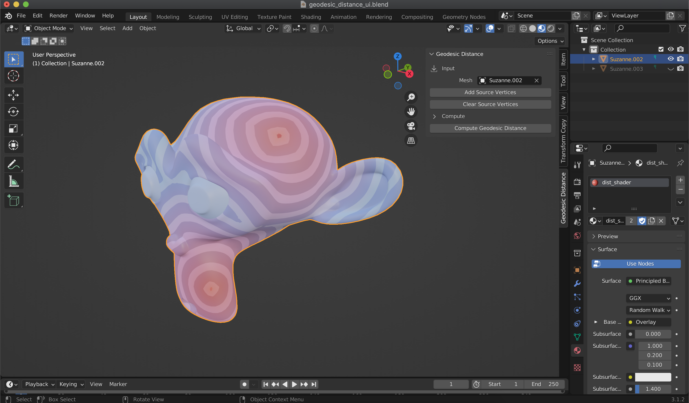

# Geodesic Distance UI Add-on Example

This is a more complex add-on example (see [the other add-on](../vertex_selector) for a simple 1 file add-on).

This example is intended to showcase:
* Using external libraries installed via `pip` (here [potpourri3d](https://github.com/nmwsharp/potpourri3d))
* Multi-file add-on development and release

For the multi-file add-on part, I based this on this very helpful and detailed blog post: [Creating multifile add-on for Blender](https://b3d.interplanety.org/en/creating-multifile-add-on-for-blender/). This solution has not been super thoroughly tested, but it seems to work for this simple example. The main feature of this implementation is that the add-on development is simplified:
* No need to rezip everything and Install in Blender, simply run `debug_script.py` script from Blender text editor
* Upon running this script, imported module `geodesic_project` is also reloaded, so changes to the code there will be taken into account

## Dependency installation

This add-on requires an external library installed via pip in Blender's Python. Before installing or developping this plugin, start by running `install_dependencies.py` script from Blender text editor.

## Using the add-on

To see how the add-on works, you can use the provided blend file `geodesic_distance_ui.blend` that contains a scene with a Suzanne mesh and has a nice material to visualize the geodesic distances that the add-on computes and stores as UV coordinates.

The add-on can be installed from the provided zip file: Edit > Preferences > Add-on > Install > select the zip file. Then tick the checkbox in front of the add-on item to install it. In case of errors, check the system console (after opening Blender from console).

After opening the add-on panel, select some vertices on the mesh (in edit mode), click `Add Source Vertice` and click `Compute Geodesic Distance`. Here is what you should see:

## Development

During development, the add-on can be reloaded quickly by using the `debug_script.py` file. Open it in Blender text editor and run it to simulate re-installing the add-on.

## Release as an add-on

To release the add-on, zip the folder `geodesic_distance_addon`. This is the file that should be selected from the Add-on installation menu.

You can try installing directly the add-on by using the provided zip file.